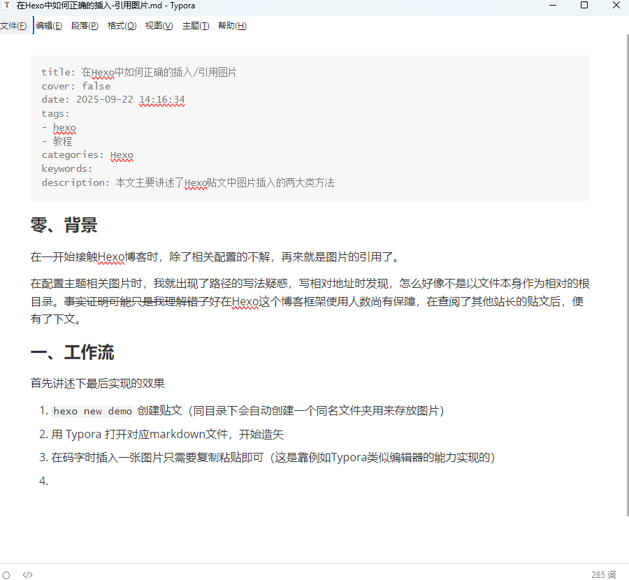
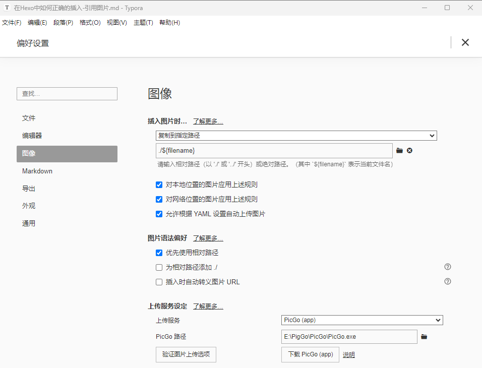

### 零、背景

在一开始接触Hexo博客时，除了相关配置的不解，再来就是图片的引用了。

在配置主题相关图片时，我就出现了路径的写法疑惑，写相对地址时发现，怎么好像不是以文件本身作为相对的根目录。~~事实证明可能只是我理解错了~~好在Hexo这个博客框架使用人数尚有保障，在查阅了其他站长的贴文后，便有了下文。

### 一、工作流

首先讲述下最后实现的效果

1. 在blog目录下输入```hexo new demo``` 创建贴文（同目录下会自动创建一个同名文件夹用来存放图片）
2. 用 Typora 打开对应markdown文件，开始造矢
3. 在码字时插入一张图片只需要复制粘贴即可，如下图（这是靠例如Typora类似编辑器的能力实现的）
4. ``hexo ge & hexo s `` 本地查看效果。无误后`` hexo  d`` 推送至站点

---


### 二、方式选择

#### 2.1 两种方式

对于Hexo这类静态博客，图片的插入主流分为两类

- **本地引用**：图片文件存储在 Hexo 项目本地目录（如 `source/images`），引用时通过「相对路径」（如 ``）关联，最终随博客静态文件（HTML/CSS/JS）一起部署到服务器（如 GitHub Pages、Vercel）。
- **线上图床**：图片文件上传至第三方平台（如阿里云 OSS、SM.MS、Imgur），引用时直接使用图床提供的「在线 URL」（如 ``），图片加载不依赖博客部署服务器，而是由图床平台提供服务。

我们该选择哪一种方式？

#### 2.2 优缺对比

|    对比维度    |                 本地引用（Local Reference）                  |               线上图床（Online Image Hosting）               |
| :------------: | :----------------------------------------------------------: | :----------------------------------------------------------: |
|  **存储位置**  |     Hexo 项目本地（如 `source/images`），随项目一起管理      |       第三方图床平台服务器（如阿里云 OSS、腾讯云 COS）       |
|   **稳定性**   | ✅ 极高：不依赖外部服务，只要博客服务器正常，图片就可用；无 “图床倒闭” 风险 | ❌ 依赖第三方：图床故障 / 封号 / 关闭会导致 “裂图”，需批量替换 URL 修复 |
|  **访问速度**  | ✅ 较快：图片随博客静态文件部署，加载时无跨域请求；若博客用 CDN，速度更优 | ⚠️ 依赖图床 CDN：知名图床（阿里云）速度快，免费小图床可能卡顿 / 地域限制（如国外图床国内访问慢） |
|  **项目体积**  | ❌ 体积大：图片越多，Hexo 项目 / Git 仓库越大，克隆 / 提交代码速度变慢 | ✅ 体积小：图片不占本地项目空间，Git 仓库仅存文章文本，管理轻便 |
|  **部署效率**  | ❌ 较低：每次部署需同步所有图片（即使未修改），占用部署流量 / 时间 |  ✅ 较高：仅部署文章静态文件，无需处理图片，节省流量 / 提速   |
| **跨平台复用** | ❌ 差：图片路径仅适用于当前博客，无法直接在公众号 / 知乎等平台复用 | ✅ 好：图床 URL 可在任何平台（博客、社交、文档）引用，无需重复上传 |
|    **成本**    |       ✅ 零成本：无额外费用（仅博客服务器 / 域名成本）        | ⚠️ 可能有成本：免费图床有容量 / 流量限制（如 SM.MS 免费版每月 10GB 流量）；付费图床（阿里云）按存储 / 流量收费，访问量大时成本上升 |
| **隐私与安全** | ✅ 高：图片仅存于自己的博客服务器，无第三方获取风险；适合私密图片 | ❌ 较低：第三方可能审查 / 获取图片内容，免费图床可能泄露隐私；敏感图片有被删除风险 |
|  **管理难度**  | ✅ 简单：图片与文章在同一项目，用 Git 可版本控制（回滚 / 备份方便）；无需额外管理工具 | ⚠️ 较复杂：需在图床平台单独管理图片（上传 / 分类 / 删除）；若无插件联动（如 Hexo 图床插件），手动维护 URL 易出错 |
|   **依赖性**   |                   无：仅依赖博客部署服务器                   |           强：完全依赖图床平台的服务稳定性与存续性           |

不知道各位在看过对比后会如何选择。~~如果不确定，我只能告诉你，你适合本地~~ 不过不管如何选择，这两种本文都会讲解部署之法

---


### 三、方法①本地引用

本章节主要讲述如何将站点改成上述的工作流

#### 3.1具体流程

1. 在终端输入 ` npm install hexo-renderer-marked `  **安装插件**
2. **确认渲染插件**

​	打开`./package.json`文件，确认当前安装并启用的渲染插件是`hexo-renderer-marked`：

```
{
  // ...
  "dependencies": {
    // ...
    "hexo-renderer-marked": "^x.x.x",
    // ...
  },
  // ...
}
```

3. **确认网站设置**

打开`./_config.yml`文件，修改或确认以下设置：

```
post_asset_folder: true
relative_link: false
marked:
  prependRoot: true
  postAsset: true
```

举例说明：
执行`hexo new post demo`后，在`demo`文章的资源路径下存放了`a.jpg`和`cover.jpg`（用作封面），目录组织结构如下：

```
./source/_posts
├── demo.md
└── demo
    ├── a.jpg
    └── cover.jpg
```

在`demo.md`的适当位置引用这两张图片，指定图片相对路径时需要假设当前目录为`./source/_posts/demo/`，而不是`demo.md`文件本身的所在目录。

*注意，这会导致本地编辑器无法正常预览图像，只能让Hexo生成的网页可以正常加载图像，此问题稍后解决；*

```
---
title: 演示
cover: cover.jpg

---
## 图片

```

现在Hexo生成的网页可以正常加载图像了。

4.  **修改渲染插件代码**

打开`./node_modules/hexo-renderer-marked/lib/renderer.js`，搜索`image`定位到修改图片相对路径的代码，按如下方式修改代码：

```javascript
// Prepend root to image path
image(href, title, text) {
  const { hexo, options } = this;
  const { relative_link } = hexo.config;
  const { lazyload, figcaption, prependRoot, postPath } = options;

  if (!/^(#|\/\/|http(s)?:)/.test(href) && !relative_link && prependRoot) {
    if (!href.startsWith('/') && !href.startsWith('\\') && postPath) {
      const PostAsset = hexo.model('PostAsset');
      // findById requires forward slash

      // ============================== 以下代码有改动 ==============================
      const fixPostPath = join(postPath, '../');
      const asset = PostAsset.findById(join(fixPostPath, href.replace(/\\/g, '/')));
      // const asset = PostAsset.findById(join(postPath, href.replace(/\\/g, '/')));
      // ============================== 以上代码有改动 ==============================
      
      // asset.path is backward slash in Windows
      if (asset) href = asset.path.replace(/\\/g, '/');
    }
    href = url_for.call(hexo, href);
  }

  let out = `';
  if (figcaption) {
    if (text) out += `<figcaption aria-hidden="true">${text}</figcaption>`;
  }
  return out;
}
```

现在，切换到`demo.md`，保留FrontMatter中`cover`的图片路径，将文章中的图片路径变更为`demo/a.jpg`：

```
---
title: 演示
cover: cover.jpg

---
## 图片

```

5. **对接markdown编辑器**

本文使用的是Typora(win版)其他类似

最后达到以下效果：

- 使用Typora编写的时候能够实时看到图片
- 本地使用`hexo server`浏览效果时，也能够看到图片
- 图片和Markdown文件放一起都上传到GitHub pages。

Typora支持将插入的图片文件拷贝到指定路径，通过`文件->偏好设置->图像`，然后参照下图选择`复制到指定路径`将图片拷贝到与Markdown文件同名目录下。



这样我们在编辑博客的时候，就可以实时看到插入的图片。可以截图插入，也可以从网页上直接拖拽插入，非常方便。最后开始愉快的编写文章（详见`一、工作流`）

> 注：***3.1具体流程的内容大都来自[Hexo插入图片并解决图片的路径问题 | Lucien的博客](https://www.hwpo.top/posts/d87f7e0c/index.html)****
>
> ​	***对接Typora*这一部分则引用了[Hexo博客写作与图片处理的经验-大江小浪](http://edulinks.cn/2020/03/14/20200314-write-hexo-with-typora/)***


### 四、方法②在线图床


太长了，于是单开了一贴，详情见[在线图床的部署之法 | C_z_jun](https://czjun.top/2025/11/02/在线图床的部署之法/)


[从0到1:用Git+CloudFlare+PicGo+Typora+Hexo搭建个人博客全流程 | Sonia33](https://blog.soniachen.com/2025/06/17/从0到1-用Git-CloudFlare-PicGo-Typora-Hexo搭建个人博客全流程/)

[PicGO 连接 AWS S3 · xiabee-瞎哔哔](https://blog.xiabee.cn/posts/pichost-picgo/#/Typora-设置)


