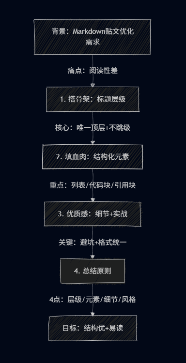

### 背景：

- 最早接触Markdown的原因也是因为ai，实际接触后发现不愧为轻量级标记语言，“简单易写 + 排版清晰”
- 但是个人撰写的相关贴文最后产出的阅读效果实在是一言难尽
- 刚好也写了有几篇文章了，现在总结一下（公式化这一块）

### 一、搭好贴文的 “骨架”—— 标题与层级

事实上写者不一定第一时间能确认全文的层级~~至少我是经常想到哪写道哪~~

但是**唯一顶层、逐级递减、层级对应内容模块**的核心原则不能违背，也就是避免以下操作

#### 错误示例

- 跳过层级：一级标题后直接用四级标题（`# 总标题` → `#### 子项`），读者无法判断逻辑关系；

- 同级标题混乱：同一模块内，一会儿用 “## 1.XXX”，一会儿用 “## 一、XXX”，格式不统一。


---

### 二、填好贴文的 “血肉”—— 用对结构化元素

大段文字是可读性的 “天敌”。不同类型的内容，需匹配对应的 Markdown 元素，让信息 “结构化呈现”。

#### 1. 列表：梳理 “有序 / 并列” 信息

列表是处理 “步骤、要点、选项” 的最佳选择，分为两种：

- **有序列表（`1. 内容`）**：用于有先后逻辑的内容（如操作步骤、流程）
  示例：
  1. 打开 Markdown 编辑器（如 Typora、VS Code）；
  2. 用`#`写一级标题，确定贴文主题；
  3. 用`##`拆分核心模块，搭建结构。
- **无序列表（`- 内容`/`*内容`）**：用于无先后的并列内容（如特点、痛点、注意事项）
  示例（Markdown 的优势）：
  - 语法简单，无需记复杂标签；
  - 跨平台兼容（博客、文档、笔记工具通用）；
  - 导出格式灵活（可转 PDF、HTML、Word）。

>  小技巧：列表可嵌套（最多 2 层，避免过深），比如 “步骤下的子要点”：
>
>  1. 配置代码块
>    - 加语言标识（如`bash`/`yaml`）；
>    - 保留代码原缩进（避免语法错乱）。

#### 2. 代码块：展示 “代码 / 命令 / 配置”

写技术贴、教程时，代码 / 命令必须用**带语言标识的代码块**，避免与普通文字混淆，且能实现语法高亮。

- #### 正确用法

```markdown
# 语法格式
```语言类型
代码/命令内容
```

- #### 错误用法

```
- 不用代码块：直接写“git branch -a 命令用于查看分支”，命令易被忽略；  
- 不加语言标识：` ``` git branch -a ``` `（无`bash`标识），无语法高亮，可读性差。
```

- #### 示例及技巧
```markdown
## 一、细节：优化贴文的“质感”——避坑+统一
好的排版藏在细节里，以下四点能让贴文质感翻倍：

### 1. 避开常见“排版坑”
- 代码块不缩进：代码块内的代码（如YAML、Python）需保留原缩进，否则语法错乱；  
- 分割线滥用：仅在“二级模块之间”用`---`，不要在段落内、列表间用（视觉杂乱）；  
- 长段落不拆分：超过3行的文字，优先拆成“核心句+列表”，比如“Markdown优势”不用大段文字，改用无序列表。

### 2. 保持“风格统一”
同一篇贴文中，相同类型的内容格式必须一致：
- 列表符号：全篇用`-`或`*`，不要混用；  
- 标题格式：二级标题统一用“## 数字. 主题”（如“## 一、基础”）或“## 主题”，不要有时加数字有时不加；  
- 链接格式：外部链接统一用“[链接文本](链接地址)”（如“[Markdown官方文档](https://daringfireball.net/projects/markdown/)”），不要直接贴URL（不直观）。
### 3. 引用块：突出“背景/补充/引用”
用`>`包裹的引用块，适合呈现“前提背景、外部引用、补充说明”，视觉上与正文区分，避免信息混杂。

示例：
> 背景：在撰写Hexo博客贴文时，需要插入本地图片，但直接用相对路径会显示异常——这是很多新手会遇到的问题。  
> 引用来源：官方文档提到“Hexo图片路径需配合`_config.yml`中的`post_asset_folder`配置使用”。


### 4. 其他元素：按需使用
- **加粗（`**内容**`）**：强调核心结论、关键信息（如“代码块必须加**语言标识**”），避免全文加粗（失去重点）；  
- **图片（``）**：插入图片时必须加`alt文本`（图片加载失败时显示，提升兼容性），路径优先用相对路径（如`./img/markdown.png`）；  
- **表格（`|表头|内容|`）**：适合对比信息（如本文“标题层级表”），避免用列表嵌套模拟表格（排版混乱）。

## 二、实战：套用模板快速上手
掌握以上规则后，可直接套用“通用贴文模板”，无需每次从零开始。以下是“教程/笔记类贴文模板”（适用于技术笔记、经验总结等）：

```markdown
# 总标题：明确贴文主题（如“Hexo图片路径配置教程”）
> 引言：简述贴文目的、适用人群（如“本文适合Hexo新手，解决本地图片显示异常问题”）
---

## 一、前提背景
### 1.1 问题场景
- 描述遇到的问题/需求（如“插入本地图片后，博客预览时显示裂图”）；
- 相关环境（如“Hexo版本：6.3.0，主题：anzhiyu”）。

### 1.2 参考资料
- [外部教程1](链接)；
- [官方文档](链接)。
---

## 二、解决方案
### 2.1 步骤1：配置`_config.yml`
```yaml
# 贴关键配置代码
post_asset_folder: true  # 开启文章资源文件夹
.......
```


### 三、图文并茂

对应文字难以清晰说明的内容，不妨用图片辅助解释

随时代发展，贴主常见的图片分为两个类型

- 传统流媒体图片（**.JPG/.WEBP/.PNG**）
- 代码绘制流程图（借用**Draw.io或PlantUML** 使用各种流程图语法）

例如本文的流程图如下:

```flow
st=>start: 背景：Markdown使用痛点
    （阅读效果差+需总结）
e=>end: 最终目标：结构优美+可读性强

op1=>operation: 一、搭“骨架”：标题层级
    • 核心：唯一顶层+逐级递减
    • 避坑：不跳级、格式统一
op2=>operation: 二、填“血肉”：结构化元素
    • 列表：有序（步骤）/无序（要点）
    • 代码块：加语言标识+保缩进
    • 引用块：背景/补充说明
op3=>operation: 三、优“质感”：细节+实战
    • 避坑：不滥用分割线、长文拆列表
    • 统一：列表/标题/链接格式一致
    • 辅助：图文并茂+套用模板
op4=>operation: 四、核心原则总结
    1.层级唯一 2.元素匹配 
    3.细节规范 4.风格统一

st->op1->op2->op3->op4->e
```

上面这张图片就是通过下面的代码（flow语言），Typora渲染出来的效果

~~~markdown
st=>start: 背景：Markdown使用痛点
    （阅读效果差+需总结）
e=>end: 最终目标：结构优美+可读性强

op1=>operation: 一、搭“骨架”：标题层级
    • 核心：唯一顶层+逐级递减
    • 避坑：不跳级、格式统一
op2=>operation: 二、填“血肉”：结构化元素
    • 列表：有序（步骤）/无序（要点）
    • 代码块：加语言标识+保缩进
    • 引用块：背景/补充说明
op3=>operation: 三、优“质感”：细节+实战
    • 避坑：不滥用分割线、长文拆列表
    • 统一：列表/标题/链接格式一致
    • 辅助：图文并茂+套用模板
op4=>operation: 四、核心原则总结
    1.层级唯一 2.元素匹配 
    3.细节规范 4.风格统一

st->op1->op2->op3->op4->e
~~~


而下面这张图片则是上传的截图(**Mermaid 流程图**)：



### 四、总结：核心原则回顾

写好Markdown贴文，无需复杂技巧，记住4个核心：
1. **层级唯一**：一级标题1个，二级拆模块，三级细化内容，不跳级；  
2. **元素匹配**：步骤用有序列表、代码用代码块、背景用引用块，不混用；  
3. **细节规范**：代码块加语言、图片加alt、长文拆列表；  
4. **风格统一**：同类型内容格式一致，避免读者频繁适应新规则。


> 本文大量采用ai进行辅助写作~~感觉还是蛮明显的~~
>
> 如有错误欢迎指出，感谢阅读
